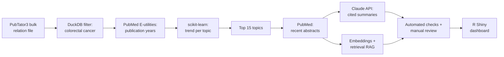

# Colorectal Cancer Research Trend Summarizer

A pipeline that finds which colorectal cancer research topics are growing fastest in the published literature, then uses an LLM to summarize what the newest papers on each topic report, with every claim tied to a PubMed ID and checked against its source.

It combines text-mined data from NCBI's PubTator3, a statistical trend model, the Claude API, and retrieval-augmented generation (RAG), with an interactive R Shiny dashboard on top.

<!-- To add a screenshot: save one as docs/dashboard.png and uncomment the line below -->
<!--  -->

## Key findings

Colorectal cancer research grew about **4.6% per year** from 2015 to 2025. Of 304 topics with at least 50 papers, these 15 grew fastest relative to the field while still having at least 30 papers since 2023:

| Topic | What it is | Papers 2015–2025 | Since 2023 | Growth per year |
|---|---|---:|---:|---:|
| N6-methyladenosine (m6A) | RNA modification | 210 | 111 | 58.7% |
| GPX4 | Ferroptosis regulator | 95 | 78 | 49.4% |
| Fruquintinib | VEGFR inhibitor (drug) | 152 | 107 | 46.9% |
| Encorafenib | BRAF inhibitor (drug) | 121 | 63 | 44.2% |
| METTL3 | Enzyme that adds m6A to RNA | 74 | 43 | 43.4% |
| STING1 | Innate immune signaling gene | 69 | 53 | 35.7% |
| Ipilimumab | CTLA-4 immunotherapy | 93 | 41 | 35.5% |
| Nivolumab | PD-1 immunotherapy | 178 | 75 | 34.2% |
| PDCD1 | PD-1 gene | 612 | 307 | 33.5% |
| Cholesterol | Metabolism | 84 | 47 | 32.6% |
| KRAS p.G12C | Targetable KRAS mutation | 113 | 67 | 31.4% |
| SLC7A11 | Ferroptosis regulator | 66 | 49 | 30.9% |
| CD274 | PD-L1 gene | 806 | 357 | 30.1% |
| PIK3CD | PI3K gene (*see Limitations*) | 99 | 87 | 30.1% |
| Pembrolizumab | PD-1 immunotherapy | 265 | 122 | 29.4% |

**The method recovers known shifts in the field.** With no information about colorectal cancer treatment built in, it surfaced drugs recently adopted for the disease (fruquintinib, encorafenib, and three immune checkpoint inhibitors) alongside active research areas like ferroptosis, m6A RNA modification, and KRAS G12C targeting.

## How it works



1. **Filter the literature.** PubTator3 is NCBI's database of genes, drugs, diseases, and the relationships between them, text-mined from about 36 million PubMed abstracts. DuckDB filters its bulk relation file to relationships involving colorectal cancer (MeSH D015179): 233,074 relationships across 106,817 articles.
2. **Date each article.** Publication years come from PubMed's E-utilities API. 46 of 106,817 IDs (0.04%) could not be retrieved.
3. **Model the trends.** For each relationship with at least 50 papers from 2015 to 2025, a log-linear regression (scikit-learn) estimates yearly growth. Each topic's growth is compared with the field's overall growth, so "trending" means growing faster than colorectal cancer research as a whole, not just being large. 2026 is excluded because it is a partial year.
4. **Clean duplicate concepts.** Mouse and human versions of the same gene, and two MeSH records for m6A, are merged and their unique articles recounted.
5. **Summarize.** For each of the 15 topics, Claude Haiku 4.5 summarizes the 8 most recent abstracts. The prompt restricts it to those abstracts and requires a PMID citation for every claim.
6. **Answer questions (RAG).** Every 2023–2025 abstract for the 15 topics is embedded with sentence-transformers (all-MiniLM-L6-v2). A question retrieves the 6 most similar abstracts, and Claude answers from only those, or says the abstracts don't cover it.
7. **Visualize.** An R Shiny dashboard shows the trend rankings, each topic's yearly publication share, the summaries with linked sources, and saved Q&A.

## Evaluation

LLM summaries can invent numbers, cite the wrong source, or misstate context. Every summary and answer runs through two automated checks:

- **Citation check:** every PMID cited must be one of the abstracts the model was given.
- **Number check:** every number in the text must appear in those abstracts.

Manual review then covered what the checks cannot. Each round of review led to a prompt change:

| Prompt | Automated checks | Found in manual review | Change made |
|---|---|---|---|
| v1 | Test run | A regional subgroup result (Spain, n=180) was presented as the overall FRESCO-2 trial result | Require subgroup and secondary analyses to be labeled |
| v2 | 13 of 15 passed | Proportions (0.82) rewritten as percentages (82%); PIK3CD summary showed its sources were mostly about the broader PI3K pathway | Forbid calculated or converted numbers; flag when abstracts cover a broader topic; plain text only |
| v3 | **15 of 15 passed** | PIK3CD summary correctly flagged its own data limitation | Current version |

The checker was refined along the way: an early version flagged digits inside gene names (such as the 274 in CD274), split thousands separators, and missed "phase III" versus "phase 3." Fixing these moved v2 from 11 to 13 of 15 before any prompt change.

**RAG test questions:**

| Question | Top similarity | Result |
|---|---:|---|
| Resistance mechanisms to KRAS G12C inhibitors | 0.79–0.84 | Answered with citations; passed checks |
| Ferroptosis as a strategy against colorectal cancer | 0.63–0.71 | Answered with citations and cell-line/animal findings labeled; passed checks |
| Recommended aspirin dose for prevention (out of scope) | 0.52–0.55 | Correctly declined: stated the abstracts do not cover it |

## Limitations

- **The checks are a screen, not proof.** A number can pass by coincidence. In one v2 summary, two converted values happened to match unrelated statistics elsewhere in the abstract. The checks also do not verify that each claim cites the *right* paper. A manual spot check found one RAG answer that attributed a finding (RSL3) to the wrong abstract.
- **Trends depend on PubTator's tagging.** A change in how a term is tagged can look like a research trend. PIK3CD's rise likely reflects general "PI3K" mentions being mapped to this specific gene; the dashboard marks it accordingly.
- **Relation extraction is automated.** PubTator3's relation model is accurate but imperfect, so some counted relationships will be wrong.
- **Summaries describe recent abstracts, not the full evidence base.** They are not systematic reviews, and nothing here is medical advice.

## Running it

### Dashboard only (no API key needed)

Requires R with these packages:

```r
install.packages(c("shiny", "bslib", "DBI", "duckdb", "dplyr", "plotly"))
```

Open `app/app.R` in RStudio and click **Run App**. The app reads `app/app_data.duckdb`, which is included in the repo.

### Full pipeline

Requires Python 3.11+ and an [Anthropic API key](https://platform.claude.com). Running every step costs well under $1 in API usage.

```bash
python -m venv .venv
.venv\Scripts\activate          # Windows; use source .venv/bin/activate on macOS/Linux
pip install requests pandas biopython scikit-learn duckdb anthropic python-dotenv sentence-transformers ipykernel
```

Create a `.env` file in the project folder containing `ANTHROPIC_API_KEY=your-key`, then run `01_explore_pubtator.ipynb` from top to bottom. Retrieving publication years for about 107,000 articles takes roughly 15 to 20 minutes because of PubMed's rate limits.

## Repository structure

```
pubtator-trend-summarizer/
├── 01_explore_pubtator.ipynb   # full pipeline: data, trends, summaries, evaluation, RAG
├── app/
│   ├── app.R                   # R Shiny dashboard
│   └── app_data.duckdb         # exported results the dashboard reads
├── data/                       # not committed: bulk download, full database, embeddings
├── .env                        # not committed: API key
└── README.md
```

## Tools

**Python:** DuckDB, pandas, scikit-learn, Biopython, sentence-transformers, Anthropic Python SDK
**R:** Shiny, bslib, plotly, dplyr, DBI/duckdb
**Data:** PubTator3, PubMed E-utilities, NCBI Gene, NLM MeSH

## Data sources

- Wei C-H, Allot A, Lai P-T, et al. PubTator 3.0: an AI-powered literature resource for unlocking biomedical knowledge. *Nucleic Acids Research*. 2024;52(W1):W540–W546. PubTator3 data are a U.S. Government work in the public domain.
- PubMed, NCBI Gene, and MeSH from the National Library of Medicine.

## Author

**Aaron Pongsugree**, M.S. Biostatistics, George Mason University
[GitHub](https://github.com/aaronpong)
